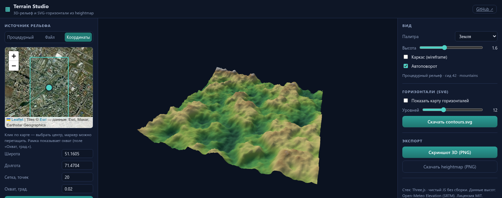

# Terrain Studio ⛰

**Интерактивный 3D-рельеф и векторные SVG-горизонтали из карты высот (heightmap).**

🔗 **Живое демо:** <https://makarimoov.github.io/terrain-studio/>

Чистый HTML/CSS/JS + [Three.js](https://threejs.org/) — без сборки, без зависимостей npm, без бэкенда. Работает локально из папки и на GitHub Pages.

## Возможности

- 🏔 **Три источника рельефа:**
  - **Процедурный** — детерминированный шум (value noise + fbm), пресеты «Горы / Холмы / Остров / Каньон / Хребты», настраиваемые сид, масштаб, октавы и шероховатость;
  - **Файл** — загрузка PNG/JPEG heightmap (яркость пикселя = высота), в том числе перетаскиванием прямо на 3D-сцену;
  - **Координаты** — реальный рельеф из бесплатного API [Open-Meteo Elevation](https://open-meteo.com/en/docs/elevation-api) (данные SRTM, ~90 м на точку) с интерактивной картой на Leaflet: клик или перетаскивание маркера выбирают центр области, рамка показывает охват.
- 🧊 **3D-визуализация:** Three.js, OrbitControls (вращение/зум/панорама), автоповорот, каркасный режим, 4 палитры высот, усиление высоты.
- 📈 **SVG-горизонтали:** марширующие квадраты (marching squares) со сглаживанием Чайкина, цвет по палитре, предпросмотр и скачивание.
- 💾 **Экспорт:** скриншот 3D-сцены (PNG), карта высот (PNG), контуры (SVG).

## Запуск

Проще всего — открыть `index.html` в браузере (модули грузятся с CDN).

Для локального сервера:

```bash
python3 -m http.server 8080
# → http://localhost:8080
```

или `npm start`.

## Тесты

Алгоритмы (шум, контуры, ресемплинг) покрыты смоук-тестом без браузера:

```bash
node test/smoke.mjs
```

## Структура

```
terrain-studio/
├── index.html          # разметка и importmap
├── css/styles.css      # тёмная тема, адаптив
├── js/
│   ├── app.js          # Three.js-сцена, состояние, UI
│   ├── noise.js        # PRNG (mulberry32), value noise, fbm, пресеты рельефа
│   ├── heightmap.js    # нормализация, ресемплинг, PNG ↔ карта высот, Open-Meteo Elevation
│   ├── contours.js     # marching squares, склейка ломаных, Чайкин, SVG
│   └── map.js          # Leaflet-карта выбора области (клик, маркер, рамка охвата)
└── test/smoke.mjs      # смоук-тесты чистых модулей
```



## Как это работает

1. Карта высот — это обычная сетка `N×N` чисел (0..1). Источник: процедурный шум, PNG-файл или API высот.
2. Сетка превращается в `PlaneGeometry` Three.js: каждая вершина поднимается на значение высоты, цвет вершины берётся из палитры.
3. Горизонтали строятся алгоритмом марширующих квадратов для каждого уровня высоты, сегменты склеиваются в ломаные и сглаживаются.

## Технологии

Three.js · Leaflet · чистый JavaScript (ES-модули) · CSS Grid · Open-Meteo Elevation (SRTM)

## Лицензия

MIT — используйте свободно.